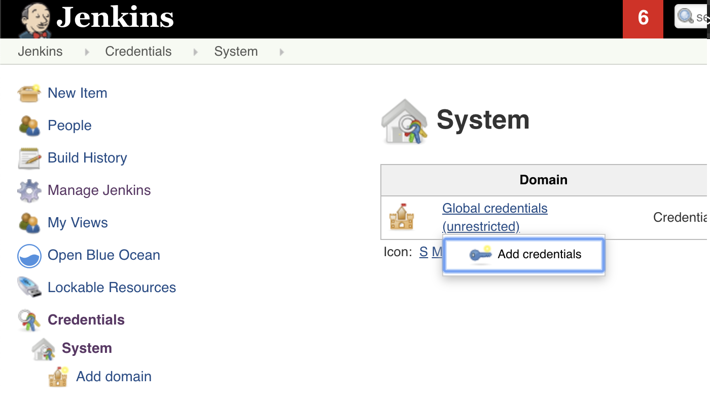
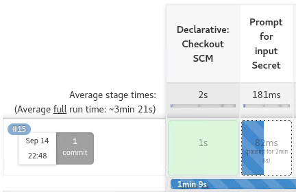

# GitOps CICD deploy application with SealedSecret
## Deploy application by Jenkins,GitLab and manage application secret with SealedSecret.

The sealed secret in GitOps is to encrypt secrets before adding them to the repository, sharing the private encryption key with those who need to use those secrets. Typically, these encryption keys are placed on the target system and used by a local agent to decrypt the credentials and place them wherever they need to be in the target environment.

This technique allows people to work with the repository without the risk of accidentally disclosing credentials, and that is an improvement over storing credentials in plain sight.

### Requirements
- OpenShift 4.X
- Git repository (Ex. GitLab, Github)
- Jenkins
- MailServer (For sent notification when deploy application.)
- Sealed Secrets controller (Deploy on OpenShift)

#### Install Sealed Secrets

**Prerequisites**
- Kubernetes 1.16+
- Helm 3.1.0

Download the Helm binary and add it to your path:
```
$ curl -L https://mirror.openshift.com/pub/openshift-v4/clients/helm/latest/helm-linux-amd64 -o /usr/local/bin/helm$ chmod 755 /usr/local/bin/helm
$ helm version
version.BuildInfo{Version:"v3.9.0+3.el8", GitCommit:"e09b16a5119e20607a4a7ae9884a96331ffff1de", GitTreeState:"clean", GoVersion:"go1.17.7"}
$
```

The Sealed Secrets helm chart is now official supported and hosted in this GitHub repo.

```
$ oc new-project sealed-secrets$ helm repo add sealed-secrets https://bitnami-labs.github.io/sealed-secrets
$ helm install sealed-secrets sealed-secrets/sealed-secrets
NAME: sealed-secrets
LAST DEPLOYED: Mon Sep 12 14:38:58 2022
NAMESPACE: sealed-secrets
STATUS: deployed
REVISION: 1
TEST SUITE: None
NOTES:
** Please be patient while the chart is being deployed **

You should now be able to create sealed secrets.

1. Install the client-side tool (kubeseal) as explained in the docs below:

    https://github.com/bitnami-labs/sealed-secrets#installation-from-source

2. Create a sealed secret file running the command below:

    kubectl create secret generic secret-name --dry-run=client --from-literal=foo=bar -o [json|yaml] | \
    kubeseal \
      --controller-name=sealed-secrets \
      --controller-namespace=sealed-secrets \
      --format yaml > mysealedsecret.[json|yaml]

The file mysealedsecret.[json|yaml] is a commitable file.

If you would rather not need access to the cluster to generate the sealed secret you can run:

    kubeseal \
      --controller-name=sealed-secrets \
      --controller-namespace=sealed-secrets \
      --fetch-cert > mycert.pem

to retrieve the public cert used for encryption and store it locally. You can then run 'kubeseal --cert mycert.pem' instead to use the local cert e.g.

    kubectl create secret generic secret-name --dry-run=client --from-literal=foo=bar -o [json|yaml] | \
    kubeseal \
      --controller-name=sealed-secrets \
      --controller-namespace=sealed-secrets \
      --format [json|yaml] --cert mycert.pem > mysealedsecret.[json|yaml]

3. Apply the sealed secret

    kubectl create -f mysealedsecret.[json|yaml]

Running 'kubectl get secret secret-name -o [json|yaml]' will show the decrypted secret that was generated from the sealed secret.

Both the SealedSecret and generated Secret must have the same name and namespace.
$ helm list
NAME            NAMESPACE       REVISION        UPDATED                                 STATUS          CHART                   APP VERSION
sealed-secrets  sealed-secrets  1               2022-09-12 14:38:58.162227106 +0000 UTC deployed        sealed-secrets-2.6.3    v0.18.2
$
```

The sealed-secrets pods error creating because security context constraint.

```
$ oc get deploy
NAME             READY   UP-TO-DATE   AVAILABLE   AGE
sealed-secrets   0/1     0            0           16m
$ oc get rs
NAME                        DESIRED   CURRENT   READY   AGE
sealed-secrets-5bdb7f75cc   1         0         0       16m
$
$ oc describe replicaset.apps/sealed-secrets-5bdb7f75cc
Events:
  Type     Reason        Age                    From                   Message
  ----     ------        ----                   ----                   -------
  Warning  FailedCreate  3m33s (x18 over 9m1s)  replicaset-controller  Error creating: pods "sealed-secrets-5bdb7f75cc-" is forbidden: unable to validate against any security context constraint: [provider "anyuid": Forbidden: not usable by user or serviceaccount, provider restricted: .spec.securityContext.fsGroup: Invalid value: []int64{65534}: 65534 is not an allowed group, spec.containers[0].securityContext.runAsUser: Invalid value: 1001: must be in the ranges: [1000760000, 1000769999], provider "nonroot": Forbidden: not usable by user or serviceaccount, provider "hostmount-anyuid": Forbidden: not usable by user or serviceaccount, provider "machine-api-termination-handler": Forbidden: not usable by user or serviceaccount, provider "hostnetwork": Forbidden: not usable by user or serviceaccount, provider "hostaccess": Forbidden: not usable by user or serviceaccount, provider "node-exporter": Forbidden: not usable by user or serviceaccount, provider "privileged": Forbidden: not usable by user or serviceaccount]
```

Edit securityContext in sealed-secrets deployment.

```
$ oc edit deploy sealed-secrets
        securityContext:
          readOnlyRootFilesystem: true
          runAsNonRoot: true
          runAsUser: 1001
        terminationMessagePath: /dev/termination-log
        terminationMessagePolicy: File
        volumeMounts:
        - mountPath: /tmp
          name: tmp
      dnsPolicy: ClusterFirst
      restartPolicy: Always
      schedulerName: default-scheduler
      securityContext:
        fsGroup: 65534
```

Change to

```
        securityContext: {}
        terminationMessagePath: /dev/termination-log
        terminationMessagePolicy: File
        volumeMounts:
        - mountPath: /tmp
          name: tmp
      dnsPolicy: ClusterFirst
      restartPolicy: Always
      schedulerName: default-scheduler
      securityContext: {}
```

sealed secrets controller pod will Running.
```
$ oc get po 
NAME                              READY   STATUS    RESTARTS   AGE
sealed-secrets-5d556f997b-dxtmr   1/1     Running   0          118s
$
```

#### GitLab 

**Prerequisites**
- Clone Application code to your gitrepository
- Update Jenkins file

Edit environment variables section in Jenkins file.

```
$ vi Jenkins

pipeline {
  agent any
  environment{
      APP_NAME = "<application name>"
      GIT_REPO = "<Git repository URL>"
      GIT_BRANCH = "Git branch"
      OPENSHIFT_DOMAIN = "<clusterID>.<basedomain>"
      OPENSHIFT_PROJECT = "<project name for deploy application>"
      OPENSHIFT_REGISTRY_ROUTE = "<OpenShift internal image registry route>"
      KUBESEAL_DOWNLOAD_URL = "https://github.com/bitnami-labs/sealed-secrets/releases/download"
      KUBESEAL_VERSION = "<kubeseal version>"
      EMAIL_RECIPIENT = "<email for notification when application deploy>"
}
```

**Example:**

```
pipeline {
  agent any
  environment{
      APP_NAME = "demo-app01"
      GIT_REPO = "gitlab.apps.cluster-xxxxx.sandbox229.opentlc.com/gitlab-instance-8f5c09e5/cicd-sealedsecret.git"
      GIT_BRANCH = "main"
      OPENSHIFT_DOMAIN = "cluster-xxxxx.sandbox229.opentlc.com"
      OPENSHIFT_PROJECT = "demo-poc"
      OPENSHIFT_REGISTRY_ROUTE = "default-route-openshift-image-registry.apps.cluster-xxxxx.sandbox229.opentlc.com"
      KUBESEAL_DOWNLOAD_URL = "https://github.com/bitnami-labs/sealed-secrets/releases/download"
      KUBESEAL_VERSION = "0.18.2"
            EMAIL_RECIPIENT = "root@bastion.xxxxx.internal"
}
```

Push the update to Git repository.

```
$ git add Jenkins
$ git commit -am "updated environment variables Jenkins file"
$ git push -u origin main
```


#### Jenkins

**Prerequisites**
- OpenShift API credential (username and password)
- Git repository credential (For push any update to repository)
- Git repository URL

**Install Additional Plugins**
- [Pipeline: Stage View](https://plugins.jenkins.io/pipeline-stage-view/)
- [Email Extension](https://plugins.jenkins.io/email-ext/)


**Setup Git Repository and Credentials for Jenkins Jobs and Jenkins Access to OpenShift**

Go to the Jenkins dashboard,

Click Credentials, or Go to Jenkins > Manage Jenkins > Configure Credentials


Go to Credentials > System


In the System view, select the dropdown for Global credentials (unrestricted),



From the drowdown, click Add credentials,

The Jenkinsfile expects an OpenShift API credential to be available named openshift-login-api,

For Kind select OpenShift Username with password,

For Scope select Global,

For Username enter username,

For Password enter password for the OpenShift web console login command,

For ID enter openshift-login-api, which is the ID that the Jenkinsfile will look for,

For Description enter openshift-login-api,


From the drowdown, click Add credentials,

The Jenkinsfile expects an Gitlab credential to be available named git-login,

For Kind select Git Username with password,

For Scope select Global,

For Username enter username,

For Password enter password for the Git web console login command,

For ID enter git-login, which is the ID that the Jenkinsfile will look for,

For Description enter git-login,


**Create a Jenkins Pipeline**

Go back to the Jenkins dashboard. If you closed Jenkins,
Click on “New” to create a new jenkins job. Select “Pipeline” as type as shown below. Name: demo-poc. Type: Pipeline


Select “Pipeline” for Pipeline script from SCM

For this particular job, click on “Pipeline” tab. This will have the following Definition options:
- Pipeline script
- for Pipeline script from SCM

Click on “Git” to select it. This will expand the section, and show all git related parameters as shown below.


Under the Git section, in the Repositories section, you’ll see the following:

Repository URL: This will be the URL of your remote repository.

Credentials: By default, this will be “None”. There will an “Add” button next to it. From here, you can specify the credentials that are required for the Git URL specified above.

Branches Specifier: Branch for where the script files are located.


Script Path: Is Jenkinsfile name


#### Build application from Jenkins.

Access to the Jenkins web console.


Start build application from Jenkins.


When build is started, The first process of pipeline will pull application codes from GitLab repository and Will prompt for input secret from user that will user for application.




Next processes is delete and re-create application project for confirm the application will use all configuration and code from GitLab repository. Then start build, verify application and wait user approval for deploy application to OpenShift


On this processed user wil receive an email notification for application deploy wait for approval.


If user confirm to process for deploy application the next processes will deploy application. And use the secret that user input previously to encrypt with SealedSecret and inject the secret to application.


The last 2 processes will upload secret that already encrypted by SealSecret to GitLab repository and expose application route for user access.


If check on GitLab repository will see the commit message is the same as trigger build number in Jenkins.


Verify application secret data is valid.
Access to the application in https://\<application route\>/<APP_NAME>

**Example:** https://\<application route\>/demo-app01


Compared with user secret data that input from previous step in Jenkins. 


Check the application secret that is uploaded to the git repository is already encrypted.

```

$ git pull
$ cat demo-app01-sealedsecret.yaml

apiVersion: bitnami.com/v1alpha1
kind: SealedSecret
metadata:
  creationTimestamp: null
  name: demo-app01
  namespace: demo-poc
spec:
  encryptedData:
    demo-app01: AgBqyPDkgJCkr1XoCqxEuEwLcKOkMfDX4N3KZRZ1bFgt7INWge3N2fXCDJWwwn4zhTzVz7oRgueoLbDFt7ptM/lbZI1Nqgy3tVt0YKzRwDXnDgBhqt7nNw4Ellt9DXoBFpEsABBLvHx8MPfUDS8MklM2vo2+DcWNc9jl2BwCNP9oOKWPsmLY04WEq+hH6OY7aZJenwzvNwhC4QTrpPL19OX0QZjmGDV927a8XuaOOerL/oUlPepMr/rlfE3ktAiBTg8/llKGeU3HWrOEw61YU3O5eVMlqk6oSjBVJTdXI8nrSuqBTfT5JQ1BCmEYMLucLhKErEG6oExw10QU6w41JAOw005dZdJe7KeybPIAlZdaNdeo8OnRgEHR+chMSSVcla7t1piVpmFNdMMPpqcI/JomHLFCLdoV2nLbbyn5Lr/4RMjPPP0eJOhyGFqg3HBPRfIA4GuW/3mtlml0aA5BQsD4DV7kaUZq/4V3jmsFfvYg+a/NZpMZl2T3iPUL7Y8OXVLLiIuAHE0zB4jA/aWjD7CF/r/VfN6pjnmA18eQJ0NNBsGVjUBxEbH/UvJn2M2URCl/FnQCaW04mYUyc48WpbuDlkPr9t4kSG5fSMsWlYQz+Zm5CzgN0ul9mY3bBoIx7JdkWwTJPE/9pGCrVi1gkQFmLFUOz3XU+REYiUZYoxBkNLIbNMnMlbraK4EbI9H9D+tvTZsFwNEyX5nD
  template:
    data: null
    metadata:
      creationTimestamp: null
      name: demo-app01
      namespace: demo-poc
```
